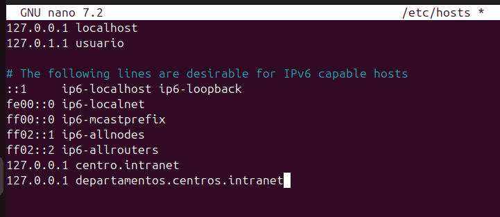
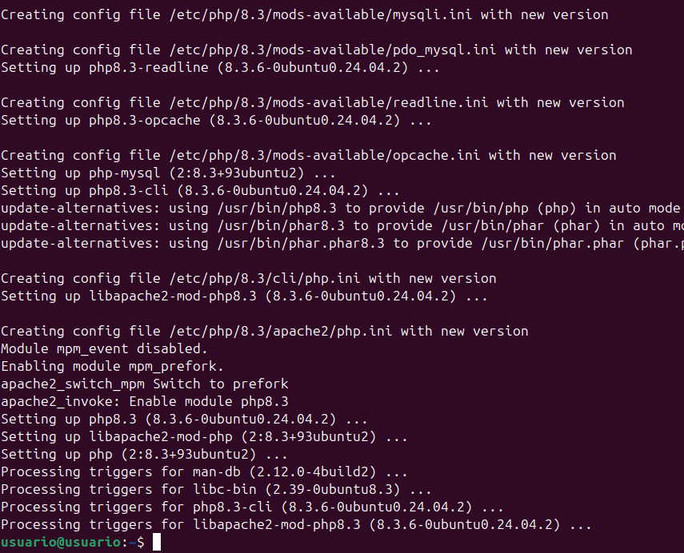

# Proyecto Primera Evaluación

## Instalación y Configuración de Servidores Web

### 1. Instalación del Servidor Web Apache
1. Abre una terminal y ejecuta el siguiente comando para instalar Apache:
    ```sh
    sudo apt-get update
    sudo apt-get install apache2
    ```

### 2. Configuración de Dominios en el Archivo Hosts
1. Edita el archivo `/etc/hosts` para añadir los dominios:
    ```sh
    sudo nano /etc/hosts
    ```
2. Añade las siguientes líneas:
    ```
    127.0.0.1 centro.intranet
    127.0.0.1 departamentos.centro.intranet
    ```
    

### 3. Activación de Módulos Necesarios para PHP y MySQL
1. Instala PHP y los módulos necesarios:
    ```sh
    sudo apt-get install php libapache2-mod-php php-mysql
    ```
    

2. Reinicia Apache para aplicar los cambios:
    ```sh
    sudo systemctl restart apache2
    ```

### 4. Instalación y Configuración de WordPress
1. Descarga y descomprime WordPress:
    ```sh
    wget https://wordpress.org/latest.tar.gz
    tar -xzvf latest.tar.gz
    sudo mv wordpress /var/www/html/centro.intranet
    ```
2. Configura los permisos:
    ```sh
    sudo chown -R www-data:www-data /var/www/html/centro.intranet
    sudo chmod -R 755 /var/www/html/centro.intranet
    ```
3. Configura Apache para WordPress:
    ```sh
    sudo nano /etc/apache2/sites-available/centro.intranet.conf
    ```
    Añade la siguiente configuración:
    ```
    <VirtualHost *:80>
        ServerAdmin admin@centro.intranet
        ServerName centro.intranet
        DocumentRoot /var/www/html/centro.intranet
        <Directory /var/www/html/centro.intranet>
            AllowOverride All
        </Directory>
        ErrorLog ${APACHE_LOG_DIR}/error.log
        CustomLog ${APACHE_LOG_DIR}/access.log combined
    </VirtualHost>
    ```
4. Habilita el sitio y reinicia Apache:
    ```sh
    sudo a2ensite centro.intranet.conf
    sudo systemctl restart apache2
    ```

### 5. Activación del Módulo WSGI para Aplicaciones Python
1. Instala el módulo WSGI:
    ```sh
    sudo apt-get install libapache2-mod-wsgi-py3
    ```
2. Configura Apache para la aplicación Python:
    ```sh
    sudo nano /etc/apache2/sites-available/departamentos.centro.intranet.conf
    ```
    Añade la siguiente configuración:
    ```
    <VirtualHost *:80>
        ServerAdmin admin@departamentos.centro.intranet
        ServerName departamentos.centro.intranet
        WSGIScriptAlias / /var/www/html/departamentos.centro.intranet/app.wsgi
        <Directory /var/www/html/departamentos.centro.intranet>
            Require all granted
        </Directory>
        ErrorLog ${APACHE_LOG_DIR}/error.log
        CustomLog ${APACHE_LOG_DIR}/access.log combined
    </VirtualHost>
    ```
3. Habilita el sitio y reinicia Apache:
    ```sh
    sudo a2ensite departamentos.centro.intranet.conf
    sudo systemctl restart apache2
    ```

### 6. Creación y Despliegue de una Aplicación Python
1. Crea una aplicación Python simple:
    ```sh
    sudo mkdir /var/www/html/departamentos.centro.intranet
    sudo nano /var/www/html/departamentos.centro.intranet/app.wsgi
    ```
    Añade el siguiente contenido:
    ```python
    def application(environ, start_response):
        status = '200 OK'
        output = b'Hello World from Python WSGI Application!'
        response_headers = [('Content-type', 'text/plain'), ('Content-Length', str(len(output)))]
        start_response(status, response_headers)
        return [output]
    ```

### 7. Protección de la Aplicación Python mediante Autenticación
1. Crea un archivo `.htpasswd` para la autenticación:
    ```sh
    sudo apt-get install apache2-utils
    sudo htpasswd -c /etc/apache2/.htpasswd usuario
    ```
2. Configura la autenticación en Apache:
    ```sh
    sudo nano /etc/apache2/sites-available/departamentos.centro.intranet.conf
    ```
    Añade las siguientes líneas dentro del bloque `<Directory>`:
    ```
    <Directory /var/www/html/departamentos.centro.intranet>
        AuthType Basic
        AuthName "Restricted Content"
        AuthUserFile /etc/apache2/.htpasswd
        Require valid-user
    </Directory>
    ```
3. Reinicia Apache:
    ```sh
    sudo systemctl restart apache2
    ```

### 8. Instalación y Configuración de AWStats
1. Instala AWStats:
    ```sh
    sudo apt-get install awstats
    ```
2. Configura AWStats:
    ```sh
    sudo nano /etc/awstats/awstats.conf
    ```
    Ajusta las configuraciones necesarias y luego actualiza las estadísticas:
    ```sh
    sudo /usr/lib/cgi-bin/awstats.pl -config=centro.intranet -update
    ```

### 9. Instalación de un Segundo Servidor (Nginx) y Configuración
1. Instala Nginx:
    ```sh
    sudo apt-get install nginx
    ```
2. Configura Nginx para el dominio `servidor2.centro.intranet` en el puerto 8080:
    ```sh
    sudo nano /etc/nginx/sites-available/servidor2.centro.intranet
    ```
    Añade la siguiente configuración:
    ```
    server {
        listen 8080;
        server_name servidor2.centro.intranet;
        root /var/www/html/servidor2.centro.intranet;
        index index.php index.html index.htm;
        location / {
            try_files $uri $uri/ =404;
        }
        location ~ \.php$ {
            include snippets/fastcgi-php.conf;
            fastcgi_pass unix:/var/run/php/php7.4-fpm.sock;
        }
    }
    ```
3. Habilita el sitio y reinicia Nginx:
    ```sh
    sudo ln -s /etc/nginx/sites-available/servidor2.centro.intranet /etc/nginx/sites-enabled/
    sudo systemctl restart nginx
    ```

### 10. Instalación y Configuración de phpMyAdmin
1. Instala phpMyAdmin:
    ```sh
    sudo apt-get install phpmyadmin
    ```
2. Configura Nginx para phpMyAdmin:
    ```sh
    sudo nano /etc/nginx/sites-available/servidor2.centro.intranet
    ```
    Añade la siguiente configuración dentro del bloque `server`:
    ```
    location /phpmyadmin {
        root /usr/share/;
        index index.php index.html index.htm;
        location ~ ^/phpmyadmin/(.+\.php)$ {
            try_files $uri =404;
            root /usr/share/;
            fastcgi_pass unix:/var/run/php/php7.4-fpm.sock;
            fastcgi_index index.php;
            fastcgi_param SCRIPT_FILENAME $document_root$fastcgi_script_name;
            include fastcgi_params;
        }
        location ~* ^/phpmyadmin/(.+\.(jpg|jpeg|gif|css|png|js|ico|html|xml|txt))$ {
            root /usr/share/;
        }
    }
    ```
3. Reinicia Nginx:
    ```sh
    sudo systemctl restart nginx
    ```

Con estos pasos, tendrás configurado un servidor web Apache con WordPress y una aplicación Python protegida por autenticación, además de un segundo servidor Nginx con phpMyAdmin.